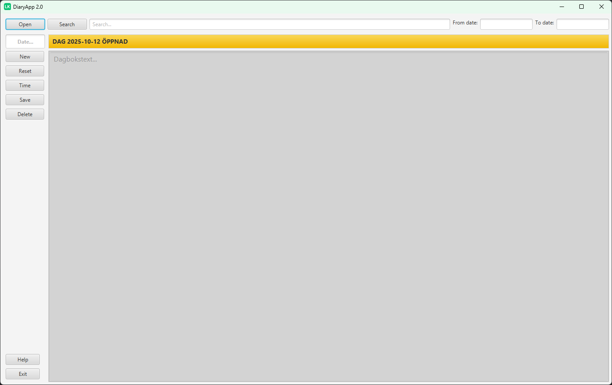

# DiaryApp

This is a project for making a diary application to easier make same daily notes and make it more fun for me to do it.
The plan for this projekt is to first just create a working version of the program concept idea and after that refactor the code to full object oriented code so the vistors of this repository can see and follow the progress of the programming work. 
 
# Update README.md 2025-11-25:  
Short video demo [here](https://youtu.be/3V9bc_yBKbQ). 
 
[DiaryApp 2.0 downloads](README2.md)

# Update README.md 2025-11-13:  

A new GUI written in JavaFX instead of Swing. And also completion of the programfuncs, started 2025-11-11.  
 
 [<<BACK](../README.md)
