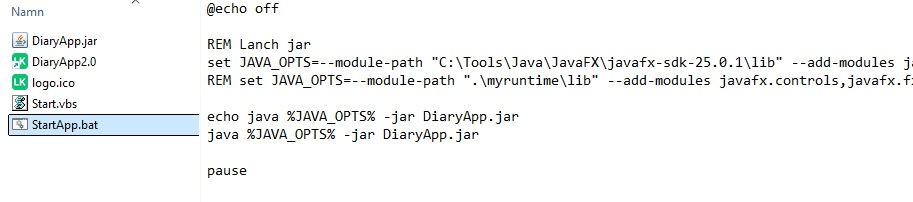

# DiaryApp 2.0
To make this app fly You need to have Java JDKv25 installed. It can be found [here](https://www.oracle.com/java/technologies/downloads/#java25).  
You also need to download JavaFX and it can be found [here](https://gluonhq.com/products/javafx/).  
- Then it is necessary to load the **javafx** from the location you have unpacked it. 
- In the file StartApp.bat. Change the module path "C:\Tools\Java\JavaFX\javafx-sdk-25.0.1\lib" to the place where you install the JavaFX.

  
Download and unpack the zip file in suitible location. And the [Manual DiaryApp 1.1](testRealese/ManualDiaryAppVersion1.1_20220529.pdf) cloese enough to get a hang how it works. But not perfect so an updated manual will com in the future.
  
# Realese 2.0 can be downloaded here
[DiaryApp 2.0](testRealese/DiaryAppVer.2.0.zip) 
# Realese version 1.1.
[Manual DiaryApp 1.1](testRealese/ManualDiaryAppVersion1.1_20220529.pdf)  
The realesed version is avalibel in directory. 
https://github.com/KarlqvistLars/MyOpenRepo/tree/main/DiaryApp/testRealese
