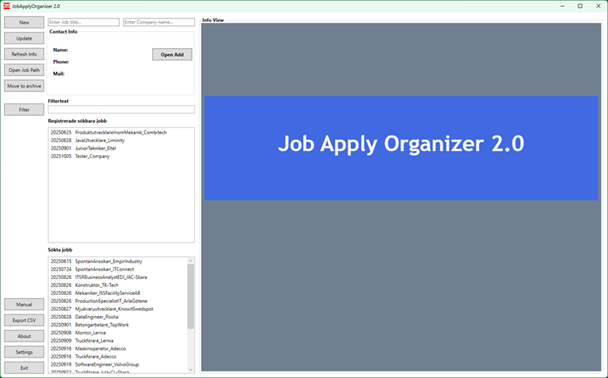
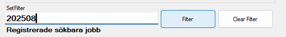
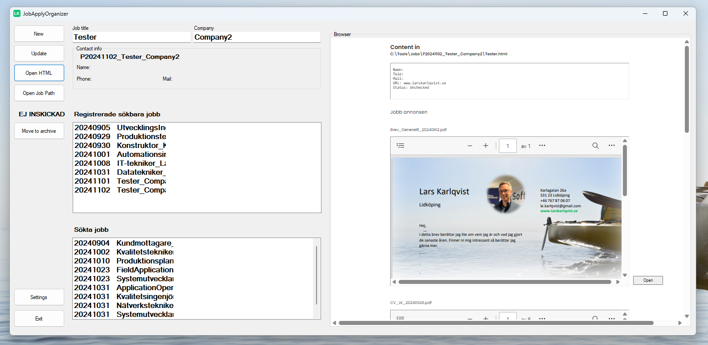
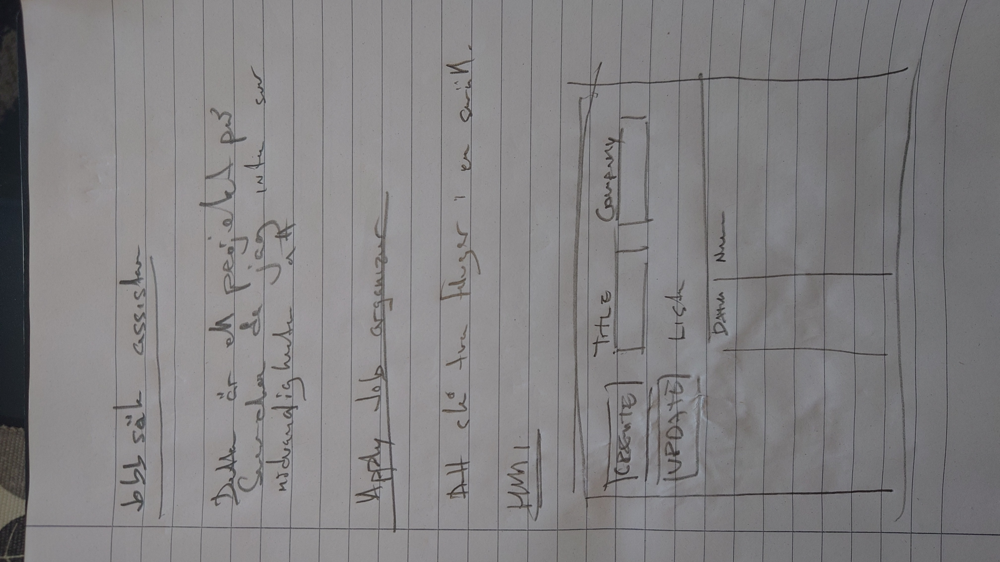
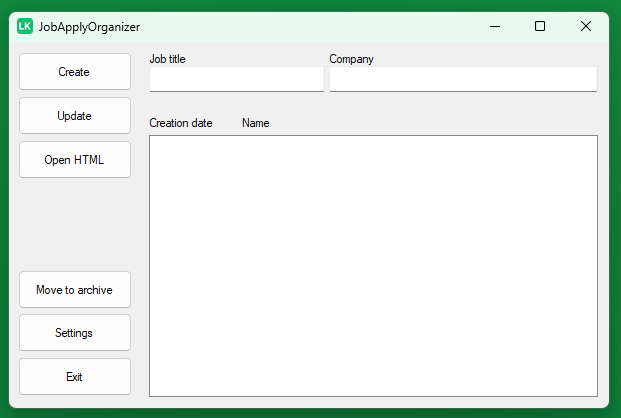

# JobApplyOrganizer
### Detta är ett verktyg att söka och organisera jobbansökningar med.

"- Att slå två flugor på en smäll."  
Att samtidigt både leta efter ett arbete, samt öva på det man önskar att arbeta med.

  
 
### NYTT OMARBETAT UI VERSION 2.0 SLÄPPT 2025-10-05

 

### Ny manual hittar ni här - [Manual_för_JobApplyOrganizer](https://github.com/KarlqvistLars/MyOpenRepo/blob/main/JobApplyOrganizer/Docs/Manual_JobApplyOrganizer_2.0_20251005.pdf) 
 

#### Installationsfilen för Windows 10 eller 11 kan laddas ner ## [här](https://github.com/KarlqvistLars/MyOpenRepo/blob/main/JobApplyOrganizer/SetupVer2.0/JobApplyOrganizer2.0_20251005.msi)
 

 
 
### NY VERSION 1.2 SLÄPPT 2025-09-22 (Ny filterfunktion tillagd 2025-09-30)
Nyhterna är funktioner för att öppna sparad jobbannons direkt, öppna template biblioteket direkt, spara sökta jobb i en *.csv fil för att kunna kopiera till excel samt en funktion för att kunna gå direkt till manualen för denna programvara.  
Nu även en praktisk filterfunktion över listrutorna med sökta jobb så att det är lättare att hitta en specifik ansökan fortare.

### Resultatet en månad senare 2024-11-03

 
Manual hittar ni här - [Manual_för_JobApplyOrganizer](https://github.com/KarlqvistLars/MyOpenRepo/blob/main/JobApplyOrganizer/Docs/Manual_JobApplyOrganizer_1.2_20250930.pdf) 
 
Installationsfilen för Windows 10 eller 11 kan laddas ner [här](https://github.com/KarlqvistLars/MyOpenRepo/blob/main/JobApplyOrganizer/SetupVer1.2/JobApplyOrganizerSetup20250930.msi) 

 

En [video](https://www.youtube.com/watch?v=gyAhbyG3KOU) jag gjorde för att i korthet berätta vad programmet är tänkt till.   
Nedan de första idéskisserna. 

### First Sketch on project
[UML](https://github.com/KarlqvistLars/MyOpenRepo/blob/main/JobApplyOrganizer/UML/UML_JobApplyOrganizer_20241004.pdf))  

 
# First version on UI design

